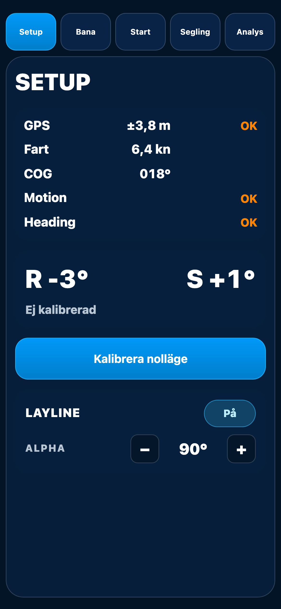
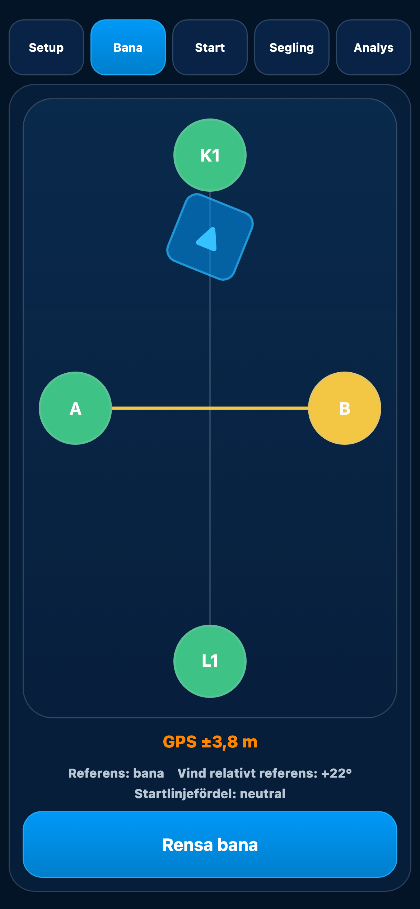
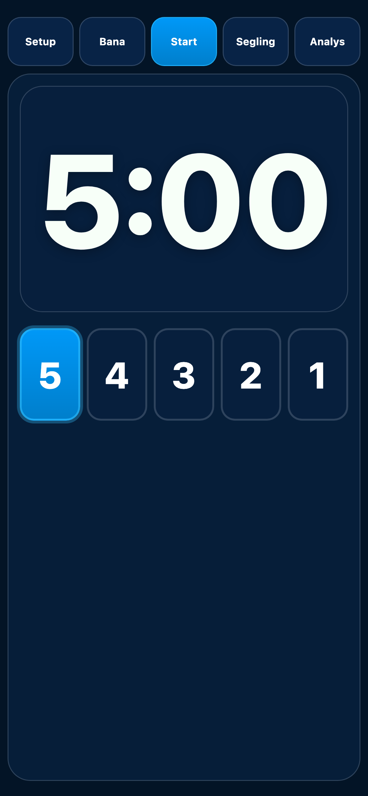
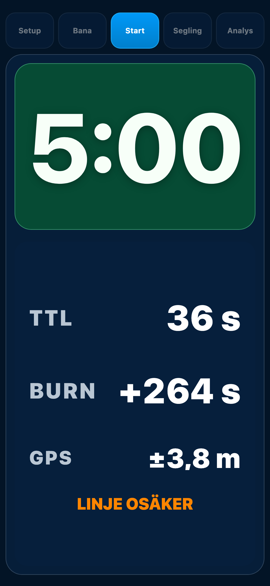
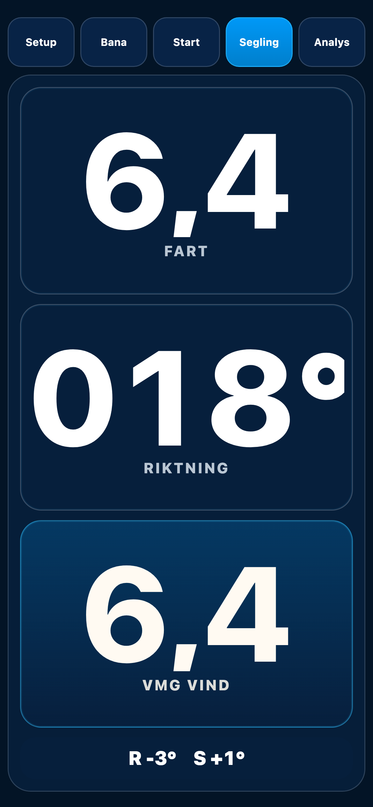
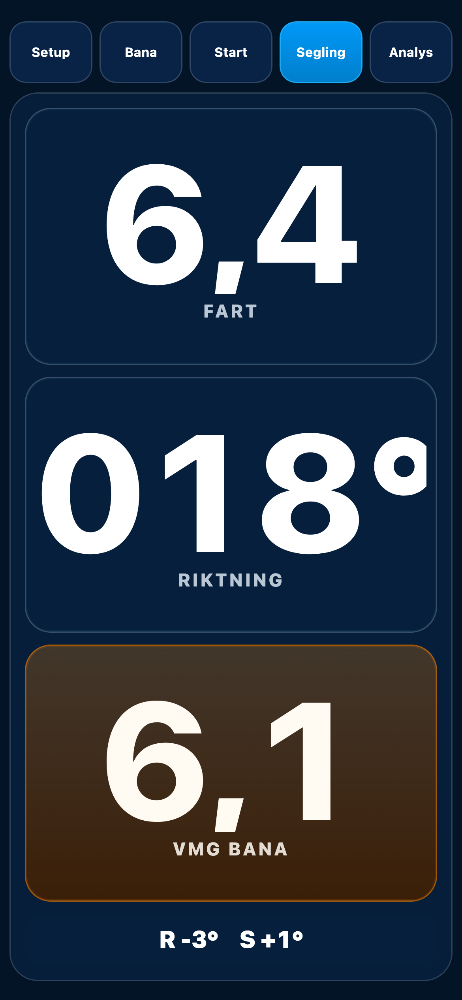
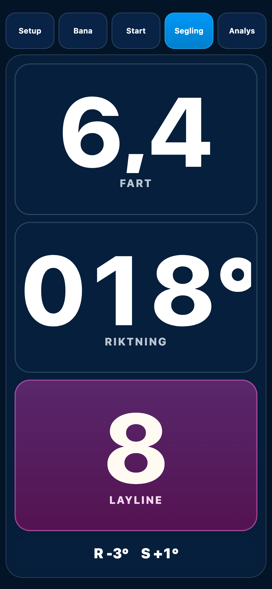
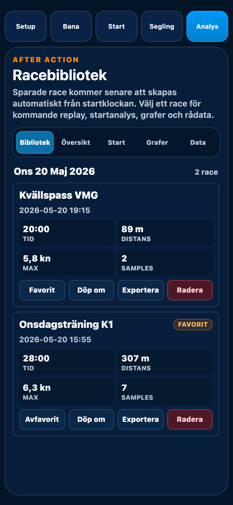
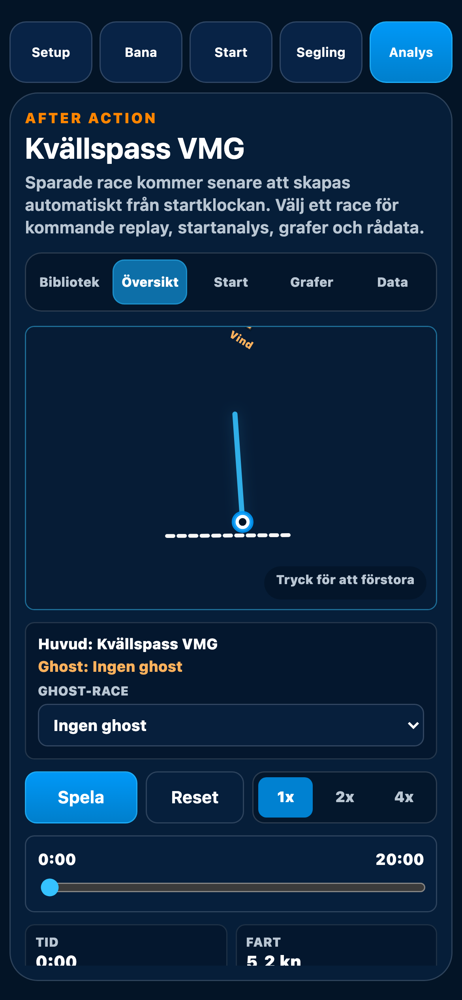
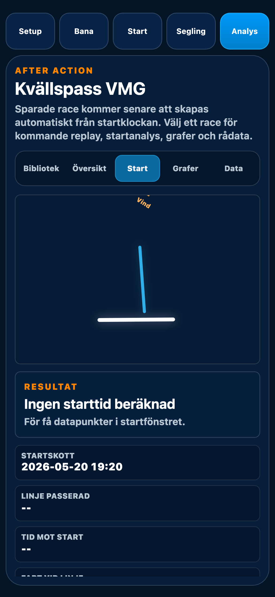

# Aster Race - Användarmanual

_Start, bana, segling och analys för kappsegling_

## 1. Snabb översikt
- Setup: GPS, sensorer, COG, R/S och Layline-inställningar.
- Bana: A/B, K1, L1 och vindriktning.
- Start: timer, TTL/BURN och GPS accuracy.
- Segling: fart, riktning, VMG Vind/VMG Bana och Layline.
- Analys: bibliotek, översikt, startanalys, grafer, data.

## 2. Setup

- GPS, Fart, COG, Motion, Heading, R/S och Kalibrera nolläge.
- Layline På/Av och Alpha 70-110° (default 90°, 1° steg med +/-).

## 3. Bana

- A/B startlinje, K1 kryssmärke, L1 länsmärke/referens.
- Vindpil för mätning/sättning av vindriktning.
- Färgkodning visar GPS-kvalitet.

## 4. Start

- 5/4/3/2/1 minuter.
- Tryck stora klockan för start/paus, långtryck för reset.
- TTL = tid till linje, BURN = över-/undertid, samt GPS accuracy.

## 5. Segling
### 5a. VMG Vind

### 5b. VMG Bana

### 5c. Layline

- Fart och Riktning (COG) från filtrerad GPS.
- R/S nederst = rullning och stampning.
- VMG-rutan växlar mellan VMG Vind (cyan/blå) och VMG Bana (orange).
- Layline (magenta) ersätter VMG-rutan temporärt, räknar 10 till -5.
- 0 = bästa uppskattning av "slå nu"; ljud vid 10 och 0, tick 9-1.

## 6. Analys

- Racebibliotek, Översikt, Start, Grafer och Data.
- Favorit, döp om, exportera, radera när tillgängligt.
- Layline-event sparas bara när race logging är aktiv.

## 7. Kort arbetsflöde
1. Setup: kontrollera sensorer och Alpha.
2. Bana: sätt A, B, K1, L1 och vind.
3. Start: välj timer och starta.
4. Segling: följ fart/riktning/VMG och Layline.
5. Analys: granska sparad segling.
